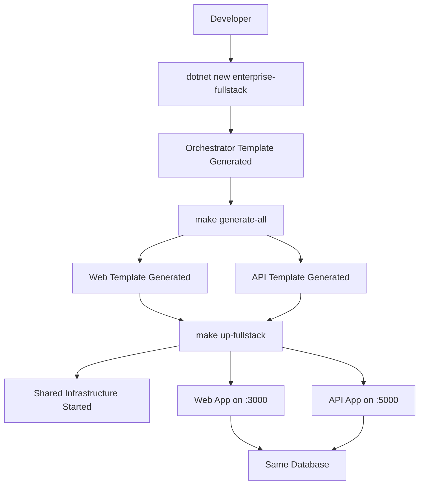
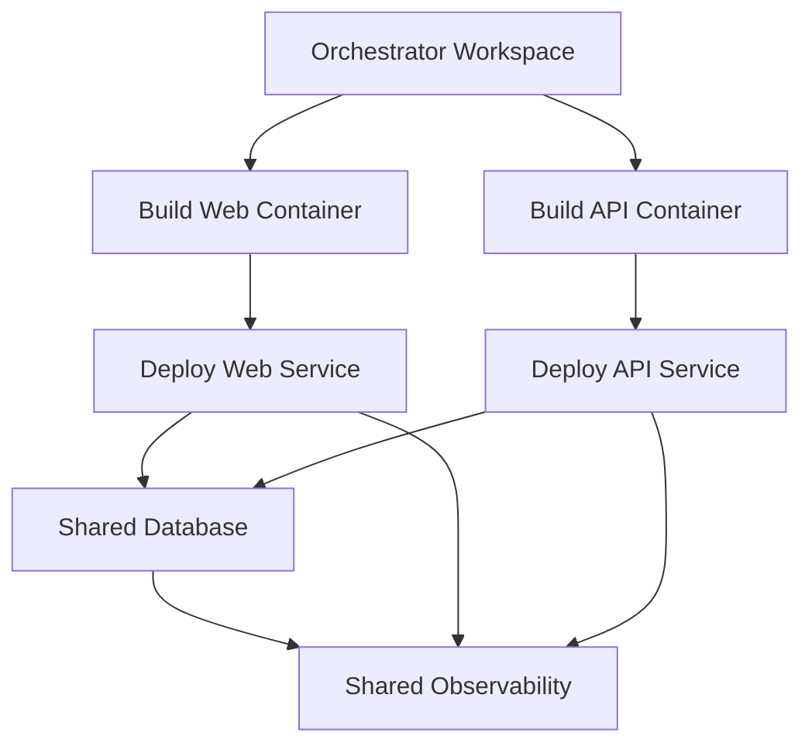

# Enterprise Templates Architecture

## 🎯 Orchestration Philosophy

This monorepo implements a **meta-template orchestration** strategy where individual templates remain completely independent while a higher-level orchestrator coordinates them for seamless integration.

## 🏗️ Core Architecture

### Independent Template Design

```
enterprise-templates/
├── templates/
│   ├── web-template/              # 100% Independent Blazor Template
│   │   ├── .template.config/     # Own template configuration
│   │   ├── src/                  # Blazor Server application
│   │   ├── Makefile             # Backend-aligned commands
│   │   └── docker-compose.envs.yml # Backend-compatible infrastructure
│   │
│   ├── backend-template/         # 100% Independent API Template
│   │   ├── .template.config/     # Own template configuration
│   │   ├── src/                  # Clean Architecture layers
│   │   ├── Makefile             # Reference implementation
│   │   └── docker-compose.envs.yml # Infrastructure definition
│   │
│   └── fullstack-orchestrator/   # Meta-Template Coordinator
│       ├── .template.config/     # Orchestration parameters
│       ├── Makefile             # Unified commands
│       ├── docker-compose.fullstack.yml # Shared infrastructure
│       └── setup.ps1            # Automated setup
```

### Template Independence

- **Zero Coupling**: Templates have no references to each other
- **Individual Usability**: Each template works perfectly in isolation
- **Separate Lifecycles**: Templates can evolve independently
- **Own Documentation**: Each has complete, standalone documentation

### Orchestration Layer

- **Workspace Coordination**: Meta-template creates workspace structure
- **Shared Infrastructure**: Common Docker services without duplication
- **Unified Commands**: Single command interface for full-stack workflows
- **Environment Management**: Coordinated configuration across templates

## 🔄 Integration Strategy

### Perfect Backend Alignment

The web template achieves perfect integration by matching backend patterns exactly:

#### 1. **Makefile Architecture**

```makefile
# Identical PowerShell detection
ifeq ($(OS),Windows_NT)
SHELL := pwsh.exe
.SHELLFLAGS := -NoProfile -Command
COMPOSE_FILE := docker-compose.envs.yml

# Identical COMPOSE_PROFILES usage
$$env:COMPOSE_PROFILES='dev'; docker compose --env-file .env.dev -f $(COMPOSE_FILE) up -d
```

#### 2. **Environment Variables**

```bash
# Backend Template Variables
DB_USER=app
DB_PASS=app
POSTGRES_DB=enterprisetemplate_dev

# Web Template Variables (identical)
DB_USER=app
DB_PASS=app
POSTGRES_DB=enterprisetemplate_dev
```

#### 3. **Service Names**

- **Database**: `postgres` (shared instance)
- **Cache**: `redis` (shared instance)
- **Message Queue**: `rabbitmq` (shared instance)
- **Tracing**: `jaeger` (shared collector)
- **Logging**: `seq` (shared collector)

#### 4. **Port Coordination**

| Service     | Backend     | Web       | Purpose         |
| ----------- | ----------- | --------- | --------------- |
| Application | 5000-5002   | 3000-3002 | Avoid conflicts |
| PostgreSQL  | 5432-5434   | Same      | Shared service  |
| Redis       | 6379-6381   | Same      | Shared service  |
| RabbitMQ    | 5672-5674   | Same      | Shared service  |
| Jaeger      | 16686-16688 | Same      | Shared service  |
| Seq         | 5341-5343   | Same      | Shared service  |

## 🐳 Infrastructure Orchestration

### Shared Services Architecture

```yaml
# fullstack-orchestrator/docker-compose.fullstack.yml
services:
  postgres:
    # Single database instance shared by web and API
    profiles: [fullstack, web-infra, backend-infra, dev, staging, prod]

  redis:
    # Single cache instance shared by web and API
    profiles: [fullstack, web-infra, backend-infra, dev, staging, prod]

  # ... other shared services
```

### Profile-Based Coordination

- **`fullstack`**: Complete Web + API + Infrastructure
- **`web-infra`**: Infrastructure needed by web template only
- **`backend-infra`**: Infrastructure needed by backend template only
- **`dev`/`staging`/`prod`**: Environment-specific configurations

### Environment Coordination

```bash
# Development Environment
make up ENV=dev     # Both Web (3000) and API (5000) with shared DB

# Staging Environment
make up ENV=staging # Both Web (3001) and API (5001) with shared DB

# Production Environment
make up ENV=prod    # Both Web (3002) and API (5002) with shared DB
```

## 🚀 Workflow Architecture

### Development Experience



### Template Generation Flow

1. **Orchestrator Creation**: `dotnet new enterprise-fullstack -n MyCompany`
2. **Project Generation**: `make generate-all` or manual template calls
3. **Infrastructure Start**: `make up-fullstack`
4. **Development**: Both apps running with shared services

### Production Deployment



## 🔧 Configuration Architecture

### Hierarchical Configuration

```
1. Template Defaults (in .template.config/template.json)
   ├─ Cloud Provider (OnPrem/Azure)
   ├─ Database Provider (Postgres/SqlServer)
   └─ Feature Flags (Auth, Caching, etc.)

2. Environment Configuration (.env.dev/.env.staging/.env.prod)
   ├─ Infrastructure Ports and Credentials
   ├─ Service Connection Strings
   └─ Observability Endpoints

3. Application Configuration (appsettings.json per template)
   ├─ Template-specific settings
   ├─ Framework configurations
   └─ Business logic settings
```

### Configuration Inheritance

- **Orchestrator → Templates**: Parameters passed to sub-templates
- **Environment → Applications**: Environment variables consumed by apps
- **Templates → Generated Code**: Configuration embedded in generated code

## 📊 Observability Architecture

### Distributed Tracing Flow

```
Web Request (3000) → API Call (5000) → Database Query
         ↓               ↓              ↓
    Trace Span      Trace Span     Trace Span
         ↓               ↓              ↓
         └───────→ Jaeger Collector ←───┘
                        ↓
                   Jaeger UI (16686)
```

### Logging Architecture

```
Web Logs ──┐
          ├──→ Seq Collector (5341) ──→ Structured Analysis
API Logs ─┘
```

### Health Check Coordination

```
make health
├─ curl localhost:3000/health (Web)
├─ curl localhost:5000/health/live (API)
└─ docker compose ps (Infrastructure)
```

## 🏛️ Benefits of This Architecture

### 1. **Clean Separation of Concerns**

- Templates remain focused on their domain (Web vs API)
- No cross-template dependencies or coupling
- Clear ownership and maintenance boundaries

### 2. **Perfect Integration**

- Service sharing works seamlessly
- No port conflicts or naming collisions
- Identical environment patterns ensure compatibility

### 3. **Flexible Usage**

- Use templates individually for specific needs
- Use orchestrator for full-stack development
- Mix and match with other templates/systems

### 4. **Maintainable Evolution**

- Templates can evolve independently
- Backend updates don't break web template
- New templates can be added without modification

### 5. **Developer Experience**

- Single command to start full-stack development
- Consistent environment management
- Unified logging and monitoring

## 🎯 Future Extensions

This architecture naturally supports:

- **Additional Templates**: Mobile, desktop, microservice templates
- **Cloud Variations**: Azure-specific, AWS-specific orchestrators
- **Tool Integration**: IDE plugins, CI/CD templates
- **Enterprise Features**: Multi-tenant, security, compliance templates

The orchestration pattern scales to any number of templates while maintaining independence and perfect integration.
